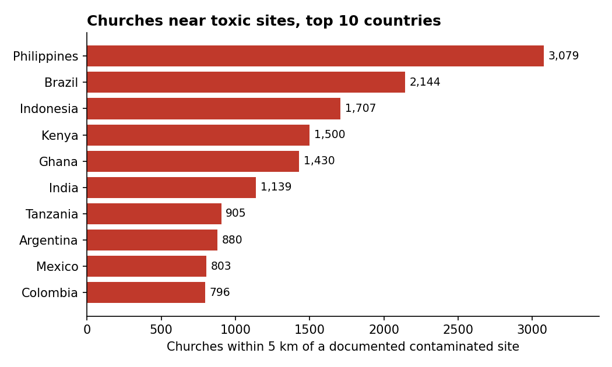

# Churches near toxic sites

A short companion analysis to the working paper *Schools in the Shadow of Toxic
Sites: Pollution Proximity in Low- and Middle-Income Countries* (Crawfurd,
2026). The paper showed that hundreds of thousands of schools sit near
documented contaminated sites. This repository asks whether the same is true of
another kind of community building — the church — and documents the method in
full so the numbers can be checked.

**Read it / explore the map:** **[lcrawfurd.github.io/churches-toxic-sites](https://lcrawfurd.github.io/churches-toxic-sites/)** — one self-contained page with the write-up, the interactive map, and references.

## Headline findings

Across **40 countries**, of **219,910** Christian places of worship mapped in
OpenStreetMap:

- **18,199 (8.3%)** sit within **5 km** of a documented contaminated site
- **2,615 (1.2%)** sit within **1 km**
- **Lead** is the most common nearby pollutant (≈9,400 churches within 5 km of a lead site)
- By denomination within 5 km: Catholic ≈4,100, Anglican ≈150, the rest unlabelled in OSM
- Most affected countries (within 5 km): Philippines (3,079), Brazil (2,144), Indonesia (1,707), Kenya (1,500), Ghana (1,430)

A companion count from the parent paper's school-census data: **10,890**
Catholic or Anglican **schools** sit within 5 km of a documented site (2,003
within 1 km).



## Methods

**1. Church locations.** Christian places of worship were downloaded from
OpenStreetMap via the Overpass API (`amenity=place_of_worship` with
`religion=christian`) for 40 countries — the 17 countries in the parent paper
plus 23 others with notable contaminated-site counts. Where present, the OSM
`denomination` tag was retained. This yields 219,910 churches. OSM maps urban
features far more completely than rural ones, so coverage is uneven across
countries (see Caveats).

**2. Contaminated sites.** Each church was matched to the nearest documented
contaminated site in Pure Earth's Toxic Sites Identification Program (TSIP) —
the same site universe as the parent paper's TSIP layer. The dataset records
the nearest site's id, key pollutant, and source-industry category.

**3. Proximity.** For each church we compute the great-circle (haversine)
distance to the nearest site, using a KD-tree on cosine-latitude-projected
coordinates for speed and refining with exact haversine — identical to the
parent paper's proximity routine. We then flag churches within 1 km and 5 km.
See [`proximity.py`](proximity.py).

**4. Denomination classes.** The free-text OSM `denomination` tag was grouped
into Catholic, Anglican, Other Christian, and Unspecified (`denom_class`).

## Reproduce

```bash
pip install -r requirements.txt
python analyse.py        # prints all summary tables; writes the chart + outputs/churches_by_country.csv
```

`analyse.py` reproduces every number in the briefing from the bundled dataset
(`data/osm_churches_near_tsip.csv`). Rebuilding that dataset from raw OSM +
TSIP additionally needs the Overpass download and the TSIP site coordinates
(obtain from Pure Earth); `proximity.py` documents that step.

## What this is and isn't

- **Proximity, not exposure.** A church within 5 km of a site is a place worth
  testing, not a confirmed contamination. Actual exposure depends on the
  pollutant, pathway, dose, and distance (effects are usually worst within a few
  hundred metres).
- **Lower bounds.** OSM misses many rural churches, and covers Christian places
  of worship only (no mosques, temples, or gurdwaras). TSIP itself captures only
  a fraction of real contaminated sites. The true counts are higher.
- **Not peer-reviewed.** This is a quick companion analysis, not a formal paper.

## Data & credits

- Church locations: © OpenStreetMap contributors (ODbL).
- Contaminated sites: Pure Earth, Toxic Sites Identification Program.
- Parent paper & replication package: see the main *Schools in the Shadow of
  Toxic Sites* repository / Zenodo deposit (DOI 10.5281/zenodo.19359187).

## Files

```
README.md            this file (findings + methods)
index.html           self-contained page: write-up + interactive map + references (GitHub Pages)
churches_1km.json / churches_5to.json / sites.json   map data
briefing_text_source.md   plain-text source of the write-up
analyse.py           reproduces summary tables + chart from the dataset
proximity.py         the core nearest-site method (documented)
requirements.txt
figures/             generated chart
data/                analysis dataset + spreadsheets + data dictionary
outputs/             generated summary tables (gitignored)
```
